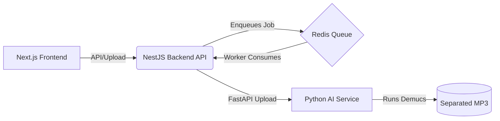

# VocalSwift 🎵

VocalSwift is a high-performance web application that isolates and extracts high-quality vocals from any uploaded audio file or YouTube URL using advanced AI separation (Demucs).

## 🚀 Features

- **AI Vocal Isolation**: Utilizes Demucs (`htdemucs` model) to precisely extract vocals from instrumental background noise.
- **YouTube Support**: Paste a YouTube URL to automatically download and process the audio.
- **Smart Silence Trimming**: Option to automatically trim long instrumental sections (silence) from the beginning and end of the extracted vocals.
- **Interactive Trimming**: Trim your vocals using a dynamic waveform interface before downloading the final MP3.
- **System Monitoring**: Live tracking of CPU/RAM usage while processing jobs.
- **Sleek UI**: Modern, dark-mode first design built with Next.js and Tailwind CSS.

## 🏗️ Architecture

VocalSwift uses a robust three-tier microservice architecture:



- **Frontend (Port 3000)**: Next.js + Tailwind CSS + Zustand + WaveSurfer.js
- **Backend (Port 3001)**: NestJS API that handles rate-limiting, uploads, and a BullMQ Redis job queue to prevent overwhelming the AI model.
- **AI Service (Port 8000)**: Python FastAPI wrapper around the Demucs AI model and FFmpeg for post-processing.

## 💻 Local Development Setup

To run VocalSwift locally, you will need to start four separate processes.

### 1. Start Redis
The background job queue requires Redis. If you have Docker:
```bash
docker run -p 6379:6379 redis
```

### 2. Start the AI Separation Service
```bash
cd separation-service
python -m venv venv
.\venv\Scripts\activate
pip install fastapi uvicorn demucs ffmpeg-python psutil yt-dlp python-multipart
uvicorn main:app --reload --port 8000
```

### 3. Start the NestJS Backend
```bash
cd backend
npm install
npm run start:dev
```

### 4. Start the Frontend
```bash
cd frontend
npm install
npm run dev
```

Finally, open [http://localhost:3000](http://localhost:3000) in your browser.

---

> **Note on Speed**: Vocal isolation is highly computationally expensive. Unless you are running on an NVIDIA GPU (CUDA), the separation process relies on your CPU and can take several minutes to process a standard 3-minute song.
